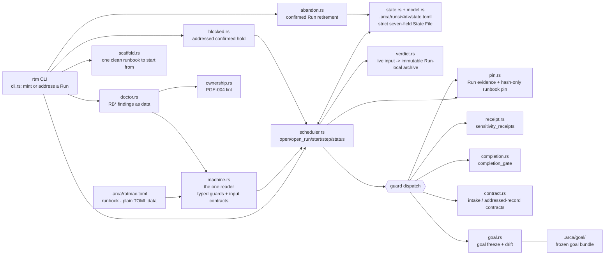

# ratmac

ratmac (`rtm`) is a Rust engine that runs agent work as an explicit state
machine. A runbook (`.arca/ratmac.toml`, plain TOML) declares phases,
prompts, guards, and transitions; the Engine instantiates it into a Run and
is the only writer of run state. Progress is proven by machine-checked
guards over artifacts on disk - never by an agent's claim. Deterministic and
offline: no network, no installs, no hidden global state.

Consult this file first, every time: the map below orients you; the routes
table locates every file; then read the file itself. The map is orientation
only, **never evidence** - a residual may not cite it.

**Where are we?** Derived from the tree, never declared - check in order:
open tickets in `.arca/ticket/` -> P4/P5 (building); `missing|partial`
residuals without tickets -> P3; goal frozen but residuals stale -> P2;
`pending` issues -> P1; none of the above -> Idle. (`.arca/state.toml`
answers only for a live `rtm` Run; until the P-cycle is the real runbook -
see steering.md, Current sprint endpoint - the tree is the oracle.)

## Map - how ratmac hangs together

Stamped cache - describes the tree through the verdict-delivery landing
(`t-062`), surveyed 2026-07-30 from a read-only pass of `src/`, `test/`, and
the current `.arca-private/t-058/` through `.arca-private/t-062/` lanes.
Refresh at each cycle close (gap check green).

### Architecture

### Binary

`rtm` - hand-rolled CLI (`src/cli.rs`, no clap): `start`, `status`, `step`,
`hold`, `abandon`, `doctor`, `scaffold`. `start` takes no Run id and mints the
next roster member; `status` and `step` require a canonical exact `--run <id>`,
`hold` binds through the same `open_run` preflight, and retiring a live Run
requires its roster id. Only leftover-lock retirement may be unaddressed;
missing or unknown addresses report the `.arca/runs/` roster. `doctor` is
read-only and deep: parse, graph, guard lint, and ownership passes over
`MachineClass`, one `RB*` finding per defect, `--json` for the finding list,
and exit `0`/`1`/`2` for clean, warnings, errors. `rtm doctor <path>` diagnoses
any runbook file - an unreadable path is the finding `RB101`, not a usage
error. `rtm scaffold <path>` writes the one runbook that starts clean.

### Modules (src/)

| Module | Role |
| :--- | :--- |
| `cli.rs` | Hand-rolled parsing of seven verbs and exit codes. `start` is unaddressed; `status`/`step` validate a canonical roster address, `hold` resolves through `open_run`, and live-Run `abandon` requires a roster id. It contains no graph or guard policy. |
| `graph.rs` | `Phase`, `Transition`, `MachineGraph` - graph position without lifecycle. `transition_for_input` selects the unique ordinary edge whose optional `input` exactly matches; `None` selects an unlabelled straight edge. Declaration order and guards never select, and blocked routes remain hold-only. |
| `machine.rs` | `MachineClass::from_toml` - the whole runbook schema boundary and its only reader, hand-rolled over `toml::Value`. It retains typed `GuardKind`, closed Phase `inputs`, and Transition `input`; RB208-RB213 reject malformed branch contracts. |
| `scheduler.rs` | Project/Run binding and ordinary execution. `open` has no Run; `open_run` binds one canonical live roster member. `open`/`open_run` and `start` refuse flat residue, while pinned reads reject runbook drift. `start` mints an uncapped never-reused id; `step` evaluates guards before verdict routing/consumption; `status` reloads and reports read-only. |
| `verdict.rs` | Strict Run-local transition-input delivery. A branch validates exact `phase`/`input`/`rationale`; a straight Phase requires an absent live slot. Valid bytes rename to monotonic `verdicts/NNNNNN.toml` evidence before State File advance; refusals consume nothing. |
| `model.rs` | `Run`, `RunArtifacts`, plural `Runs`, and serde `RunState`/`Status`; persisted state belongs to `.arca/runs/<id>/state.toml`. |
| `state.rs` | Strictly parses and atomically replaces the addressed `.arca/runs/<id>/state.toml`. The write path is crate-private, centralizing Engine writes without filesystem-enforcing ownership, and it renders the report behind `rtm status`. |
| `pin.rs` | Run evidence: stable Engine identity, gate-artifact pins, goal baseline/freeze, and the hash-only SHA-256 pin of canonical `.arca/ratmac.toml`. Non-exempt command guards run pinned code. |
| `receipt.rs` | Sensitivity receipts; digests re-derived, self-verifying. |
| `completion.rs` | Completion gate: green + fresh via tree digest. |
| `contract.rs` | Intake/record contract gates; the record gate receives the addressed Run id for frozen-goal evidence. Project-specific `.arca/issue`, `.arca/residual`, `.arca/ticket`, and `.arca/goal` paths remain R-016 debt. |
| `goal.rs` | Goal freeze and drift check (content hash of `.arca/goal/`). |
| `blocked.rs` | Plans and applies an always-addressed human-confirmed hold: ticket/blocker checks, `open_run` residue/pin preflight, declared blocked route, then all-or-none named-Run state, history, and ticket updates. |
| `abandon.rs` | Human-confirmed retirement. A live Run requires `--run`; class/pin/residue checks are intentionally bypassed so broken Runs remain retireable. One terminal event and retirement of that Run's state/evidence plus any leftover lock are all-or-none; its directory remains to reserve the id. |
| `ownership.rs` | PGE-004 ownership lint over prompts and guard contracts; the doctor's fourth pass. |
| `doctor.rs` | DRD-001..007: findings as data. Diagnoses through `machine.rs` and never walks runbook TOML itself; owns the graph and guard-lint passes, JSON rendering, and exit-code mapping. |
| `scaffold.rs` | AAL-002: the smallest doctor-clean runbook, written at a path that does not exist yet. One file, no options, never overwrites. |

### Runbook shape (`.arca/ratmac.toml`)

Defined once, in [runbook-spec.md](runbook-spec.md): top level, Phase and
transition fields, the closed guard-kind vocabulary with each kind's required
and optional fields, the ownership rules, and the `RB*` diagnostic codes. This
map deliberately keeps no copy - a second copy would be a second schema.

Goal drift and per-Run runbook-pin verification are implicit Engine checks,
not runbook guard kinds; verdict validation is input routing, not guard
dispatch. No dedicated git-state guard exists; only `command_exit` can invoke
an external program to inspect repository state.

### Tests

`test/qa/` cargo crate, public integration suites through `t062`. Current FDC
coverage is `t059_run_residency` (4 tests), `t060_runbook_pin` (3),
`t061_uncapped_runs` (2), `t061_input_routing` (3), and
`t062_verdict_delivery` (4). Wording surfaces (caller policy, schema rules)
are asserted against `.arca/schema.md` and `AGENTS.md`. Hidden lanes
`.arca-private/t-058/` through `t-062/` contain 6/6/6/5/6 tests. Opt-in
release lane: `RATMAC_RELEASE_ACCEPTANCE=1`.

### Known limitations / deferred debt (steering.md)

- Findings carry a location (`phase "build" guard 0`), never a line or span:
  an agent repairs by name, not by cursor position.
- R-016 remains deferred: `contract.rs`/`blocked.rs`/`goal.rs` bake
  project-specific `.arca/issue|ticket|residual|goal` paths into Rust.

## Read next

| You want | Read |
| :--- | :--- |
| Where we are heading; the lines no work may cross | [steering.md](steering.md) |
| How to contribute: loop, tickets, evidence - **binding** | [schema.md](schema.md) |
| What happened lately | [log.md](log.md) tail |

## Where things live

All agent routing and documentation must use these paths.

| Path | What lives there |
| :--- | :--- |
| `.arca/steering.md` | Direction and guardrails: thesis, invariants, non-goals; first re-aligned on a pivot. |
| `.arca/schema.md` | The working rules - binding for every contributor. |
| `.arca/runbook-spec.md` | What a runbook **is** - the one definition of the Machine Class format, guard kinds, ownership, and `RB*` diagnostics. |
| `.arca/runbook-authoring.md` | How to write one - scaffold, edit, `rtm doctor --json`, repair by code. Procedure only; every schema fact is a link into the specification. |
| `.arca/dict.md` | Glossary - plain-word definitions; consult before coining a term, add an entry when introducing one. |
| `.arca/goal/` | The goal bundle now in force (`spec.md` > `design.md` > `test-list.md`, plus `ubi-lang.md`, `index.md`). Frozen per Run. |
| `.arca/issue/<issue-id>/` | One incoming issue, exactly five files (shape: schema.md, "The issue folder"). |
| `.arca/residual/` | Gap records, one per requirement - proven yet? |
| `.arca/ticket/` | Small self-contained work units, cut from gap records. |
| `.arca/state.toml` | Run state - written ONLY by `rtm`; everyone else reads. |
| `.arca/log.md` | Append-only history; every landing leaves a line. |
| `.arca/tpl/` | Blank forms; a form filled in at its proper path is the real thing. |
| `.arca/vis/` | Shared pictures and graphs. |
| `.arca-private/` | Hidden test code, out of git, listed by its owning ticket. |
| `test/` | The runnable suite plus `test/test-list.md`. |
| `src/` | The Engine - mapped above. |

## Bootstrap

    pwsh -File tools/rtm.ps1   # resolve (or build) and pin-check the Engine
    rtm doctor                 # orient: engine identity, runbook, run state

Details, caller policy, and everything binding: [schema.md](schema.md).
