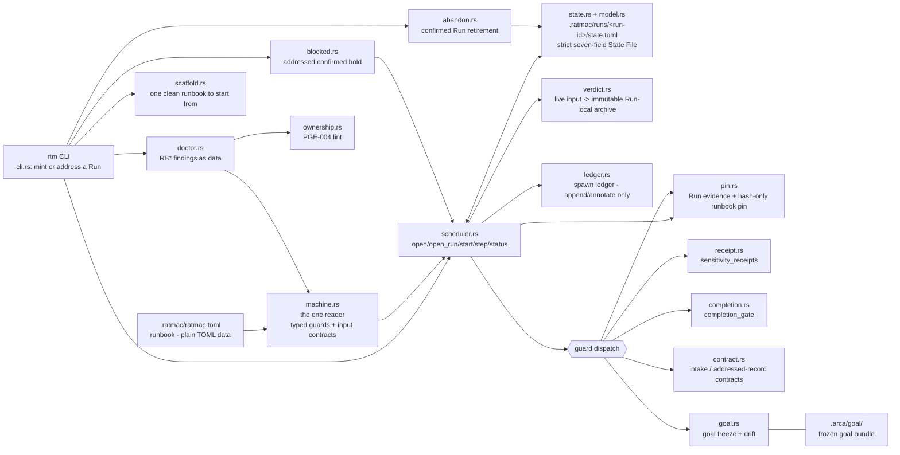

# ratmac

ratmac (`rtm`) is a Rust engine that runs agent work as an explicit state
machine. Its shared runtime root is the primary checkout's `.ratmac/`; the Machine Class
(`.ratmac/ratmac.toml`, plain TOML) is read from the invoking checkout and declares phases,
prompts, guards, and transitions; the Engine instantiates it into a Run and is the only writer
of run state. Progress is proven by machine-checked guards over artifacts on disk - never by an
agent's claim. Deterministic and offline: no network, no installs, no hidden global state.

Consult this file first, every time: the map below orients you; the routes
table locates every file; then read the file itself. The map is orientation
only, **never evidence** - a residual may not cite it.

**Where are we?** Derived from the tree, never declared - check in order:
open tickets in `.arca/ticket/` -> P4/P5 (building); `missing|partial`
residuals without tickets -> P3; goal frozen but residuals stale -> P2; a
`pending` issue bundle directly under `.arca/issue/` -> P1; none of the above
-> Idle. Bundles in `.arca/issue/deferred/` are live waiting work but do not
force P1. Selecting one visibly moves that same complete bundle to the intake
work area and changes its status to `pending`. (`.ratmac/runs/<run-id>/state.toml` answers only
for a live `rtm` Run; until the **Plan-Build Runbook** is this project's
Machine Class, the tree is the oracle - see steering.md, Current sprint endpoint.)

## Map - how ratmac hangs together

Stamped cache - describes the tree through the full doctor executable
fingerprint landing (`t-070`, `3e6ee6c`), surveyed 2026-08-04. The accepted
carrier is `.arca/issue/archive/i-023-doctor-full-fingerprint/`; `DFP-001`
widens only the argument-free human doctor's rendered Engine SHA-256 from a
16-character prefix to the complete 64-character lowercase digest. The fresh
public proof is in `test/qa/tests/t045_bootstrap_doctor.rs`; inherited public
behavior remains green, and `.arca-private/t-058/` through
`.arca-private/t-070/` hold the current hidden lanes. Every Architecture,
Binary, Modules, and Tests row below describes this landed tree. Refresh at
each cycle close (gap check green).

### Architecture

### Binary

`rtm` - hand-rolled CLI (`src/cli.rs`, no clap): `start`, `status`, `step`,
`hold`, `abandon`, `spawn`, `respawn`, `doctor`, `scaffold`. `start` takes no
Run id and mints the next roster member; `status` and `step` require a
canonical exact `--run <id>`, `hold` binds through the same `open_run`
preflight, and retiring a live Run requires its roster id. `spawn` creates a
declared child from a parent's spawning Phase as ordinary checked motion;
`respawn` and live-run `abandon` demand `--confirm` phrases naming the run id
(FDC-007). Only leftover-lock retirement may be unaddressed;
missing or unknown addresses report the `.ratmac/runs/` roster. `doctor` is
read-only and deep: its argument-free human report identifies the exact
running Engine with the complete 64-character lowercase SHA-256, then reports
parse, graph, guard-lint, and ownership findings over `MachineClass`; `--json`
remains the finding list only, with exit `0`/`1`/`2` for clean, warnings, and
errors. `rtm doctor <path>` diagnoses any runbook file - an unreadable path is
the finding `RB101`, not a usage error. `rtm scaffold <path>` writes the one
runbook that starts clean.

### Modules (src/)

| Module | Role |
| :--- | :--- |
| `cli.rs` | Hand-rolled parsing of nine verbs and exit codes. `start` is unaddressed; `status`/`step` validate a canonical roster address, `hold` resolves through `open_run`, live-Run `abandon` requires a roster id, and `spawn`/`respawn` address the parent and superseded run. Argument-free human `doctor` renders the complete SHA-256 of the exact current executable; executable selection and hashing remain unchanged. It contains no graph or guard policy. |
| `graph.rs` | `Phase`, `Transition`, `MachineGraph` - graph position without lifecycle. `transition_for_input` selects the unique ordinary edge whose optional `input` exactly matches; `None` selects an unlabelled straight edge. `has_ordinary_outgoing` is the one structural terminal predicate (blocked routes excluded). Declaration order and guards never select, and blocked routes remain hold-only. |
| `machine.rs` | `MachineClass::from_toml` - the whole runbook schema boundary and its only reader, hand-rolled over `toml::Value`. It retains typed `GuardKind`, closed Phase `inputs`, and Transition `input`; RB208-RB213 reject malformed branch contracts, and inline `classes`, per-Phase `spawns`, and the `join` guard kind parse one level deep with RB501-RB506 rejecting malformed composition (FDC-009). |
| `scheduler.rs` | Project/Run binding and ordinary execution. `open` has no Run; `open_run` binds one canonical live roster member. `open`/`open_run` and `start` refuse flat residue, while pinned reads reject runbook drift. `start` mints an uncapped never-reused id and writes `passed` when the initial Phase is terminal; `step` refuses a passed Run by name, evaluates guards before verdict routing/consumption, and writes `passed` beside a terminal successor in one replacement; `status` reloads and reports read-only. `resolve_phase_scope` reads a child Run through its own class's view for step and status alike (FDC-010/FDC-011); `spawn` mints a declared child as an ordinary flat Run and appends its ledger entry, refusing any parent that is itself a recorded child (FDC-012); `respawn` supersedes by confirmed phrase; the `join` guard reads the ledger's live children's terminal facts. |
| `ledger.rs` | The Scheduler-owned per-run spawn ledger (FDC-011): append at spawn, successor entries at respawn, abandoned-mark flips at retirement - never rewritten; strict read refuses malformed entries by name. |
| `verdict.rs` | Strict Run-local transition-input delivery. A branch validates exact `phase`/`input`/`rationale`; a straight Phase requires an absent live slot. Valid bytes rename to monotonic `verdicts/NNNNNN.toml` evidence before State File advance; refusals consume nothing. |
| `model.rs` | `Run`, `RunArtifacts`, plural `Runs`, and serde `RunState`/`Status`; persisted state belongs to `.ratmac/runs/<run-id>/state.toml`. |
| `state.rs` | Strictly parses and atomically replaces the addressed `.ratmac/runs/<run-id>/state.toml`. The write path is crate-private, centralizing Engine writes without filesystem-enforcing ownership, and it renders the report behind `rtm status`. |
| `pin.rs` | Run evidence: stable Engine identity, gate-artifact pins, goal baseline/freeze, and the hash-only SHA-256 pin of canonical `.ratmac/ratmac.toml`. Non-exempt command guards run pinned code. |
| `receipt.rs` | Sensitivity receipts; digests re-derived, self-verifying. |
| `completion.rs` | Completion gate: green + fresh via tree digest. |
| `contract.rs` | Intake/record contract gates; the intake gate parses ask dispositions across intake, deferred, and archive as one issue-id namespace, while the record gate receives the addressed Run id for frozen-goal evidence. Project-specific `.arca/issue`, `.arca/residual`, `.arca/ticket`, and `.arca/goal` paths remain R-016 debt. |
| `goal.rs` | Goal freeze and drift check (content hash of `.arca/goal/`). |
| `blocked.rs` | Plans and applies an always-addressed human-confirmed hold: ticket/blocker checks, `open_run` residue/pin preflight, declared blocked route, then all-or-none named-Run state, history, and ticket updates. A passed Run refuses the hold before any route lookup (FDC-002). |
| `abandon.rs` | Human-confirmed retirement. A live Run requires `--run`; class/pin/residue checks are intentionally bypassed so broken Runs remain retireable. One terminal event naming the addressed Run durably precedes retirement of that Run's state/evidence plus any leftover lock, all-or-none; its directory remains to reserve the id. A ledger-recorded child's confirmed retirement also flips its entry's abandoned mark. |
| `ownership.rs` | PGE-004 ownership lint over prompts and guard contracts; the doctor's fourth pass. |
| `doctor.rs` | DRD-001..007: findings as data. Diagnoses through `machine.rs` and never walks runbook TOML itself; owns the graph, guard-lint, and cycle-termination passes (FDC-008: every cycle carries a guard-kind-checked out-edge), JSON rendering, and exit-code mapping. |
| `scaffold.rs` | AAL-002: the smallest doctor-clean runbook, written at a path that does not exist yet. One file, no options, never overwrites. |

### Runbook shape (`.ratmac/ratmac.toml`)

Defined once, in [runbook-spec.md](runbook-spec.md): top level, Phase and
transition fields, the closed guard-kind vocabulary with each kind's required
and optional fields, the ownership rules, and the `RB*` diagnostic codes. This
map deliberately keeps no copy - a second copy would be a second schema.

Goal drift and per-Run runbook-pin verification are implicit Engine checks,
not runbook guard kinds; verdict validation is input routing, not guard
dispatch. No dedicated git-state guard exists; only `command_exit` can invoke
an external program to inspect repository state.

### Tests

`test/qa/` cargo crate, public integration suites through `t070`. Current FDC
coverage is `t059_run_residency` (4 tests), `t060_runbook_pin` (3),
`t061_uncapped_runs` (2), `t061_input_routing` (3), `t062_verdict_delivery`
(4), `t063_run_completion` (4), `t064_composition_format` (3),
`t065_motion_authorization` (3), `t066_spawn_ledger` (3),
`t067_cycle_termination` (2), `t068_recursion_cap` (2), and
`t069_child_reviewer` (2). DFP-001 is proven by
`t045_bootstrap_doctor::doctor_reports_complete_engine_fingerprint_and_is_write_free`
plus the inherited `t045` and `t057` suites. Wording surfaces (caller policy,
schema rules) are asserted against `.arca/schema.md` and `AGENTS.md`. Hidden
lanes `.arca-private/t-058/` through `t-070/` contain
6/6/6/5/6/6/6/6/6/5/6/6/6 tests. Opt-in release lane:
`RATMAC_RELEASE_ACCEPTANCE=1`.

### Known limitations / deferred debt (steering.md)

- Findings carry a location (`phase "build" guard 0`), never a line or span:
  an agent repairs by name, not by cursor position.
- R-016 remains deferred: `contract.rs`/`blocked.rs`/`goal.rs` bake
  project-specific `.arca/issue|ticket|residual|goal` paths into Rust.

## Read next

| You want | Read |
| :--- | :--- |
| Where we are heading; the lines no work may cross | [steering.md](steering.md) |
| How to contribute: loop, tickets, evidence - **binding** | [schema.md](schema.md) |
| What happened lately | [log.md](log.md) tail |
| Unchosen ideas parked with zero commitment | [Wishlist](wishlist.md) |

## Where things live

All agent routing and documentation must use these paths.

| Path | What lives there |
| :--- | :--- |
| `.arca/steering.md` | Direction and guardrails: thesis, invariants, non-goals; first re-aligned on a pivot. |
| `.arca/schema.md` | The working rules - binding for every contributor. |
| `.arca/runbook-spec.md` | What a runbook **is** - the one definition of the Machine Class format, guard kinds, ownership, and `RB*` diagnostics. |
| `.arca/runbook-authoring.md` | How to write one - scaffold, edit, `rtm doctor --json`, repair by code. Procedure only; every schema fact is a link into the specification. |
| `.arca/dict.md` | Glossary - plain-word definitions; consult before coining a term, add an entry when introducing one. |
| `.arca/wishlist.md` | Unordered wishes with zero commitment; the Advisor appends its own observations here (schema.md, "The wishlist"), and only a human promotes one into planning. |
| `.arca/goal/` | The goal bundle now in force (`spec.md` > `design.md` > `test-list.md`, plus `ubi-lang.md`, `index.md`). Frozen per Run. |
| `.arca/issue/<issue-id>/` | Intake work area for a newly created or explicitly selected issue; one exact five-file bundle (shape: schema.md, "The issue folder"). |
| `.arca/issue/deferred/<issue-id>/` | Deferred issue buffer: the live waiting location for that same five-file bundle when any `spec.md` ask is `deferred`; `index.md` status mirrors it as `deferred`. |
| `.arca/issue/archive/<issue-id>/` | Completed issue history: the same five-file shape, no `deferred` ask, and `index.md` status `rejected` or `integrated`; an integrated bundle has at least one accepted-or-duplicate ask, and duplicate-only integration adds no new goal row. |
| `.arca/residual/` | Gap records, one per requirement - proven yet? |
| `.arca/ticket/` | Small self-contained work units, cut from gap records. |
| `.ratmac/` | Shared Engine runtime root at the primary checkout: Git-ignored `runs/`, `mint.toml`, `locks/`, and `log.md`; the invoking checkout's Machine Class `ratmac.toml` and receipts under `evidence/<run-id>/` stay tracked. |
| `.ratmac/runs/<run-id>/state.toml` | Per-Run State File - written ONLY by `rtm`; everyone else reads. |
| `.arca/log.md` | Human-only append-only history; every human landing leaves a line. `rtm` logs transitions in `.ratmac/log.md`. |
| `.arca/tpl/` | Blank forms; a form filled in at its proper path is the real thing. |
| `.arca/vis/` | Shared pictures and graphs. |
| `.arca-private/` | Hidden test code, out of git, listed by its owning ticket. |
| `test/` | The runnable suite plus `test/test-list.md`. |
| `src/` | The Engine - mapped above. |

## Issue movement and reviewable history

The three issue locations form one issue-id namespace, with issue numbers
unique across all three. P1 works only `pending` bundles in the intake work
area. A deferred issue stays whole in the live buffer; selecting it moves that
same bundle and issue id to intake, sets its status to `pending`, and carries
the required live-link rewrites with it. Waiting in the buffer alone never
puts the tree in P1.

A completed bundle with no deferred ask may move whole into archive when its
status is `rejected`, or when it is `integrated` with at least one
accepted-or-duplicate ask; duplicate-only integration adds no new goal row.
The move preserves identity, shape, and content except required relative-link
rewrites. If a parsed archived `spec.md` contains any `deferred`
disposition, the correction restores that exact complete bundle to
`deferred/`, changes `index.md` status to `deferred`, and retargets the live
inbound and outbound links without minting a replacement or second carrier.
Links inside already archived records are frozen provenance, including inbound
links to the restored issue, and stay byte-for-byte unchanged.

Acceptance and merge-gate evidence is reviewable only when every file under
its declared roots is tracked or staged, or is enumerated as an explicit
exception. The evidence stores a manifest of path, tracking state, and SHA-256
beside the claim. The binding archive, restoration, and snapshot rules are in
[schema.md](schema.md#evidence-and-archive-rules).

## Bootstrap

    pwsh -File tools/rtm.ps1   # resolve (or build) and pin-check the Engine
    rtm doctor                 # orient: engine identity, runbook, run state

Details, caller policy, and everything binding: [schema.md](schema.md).
