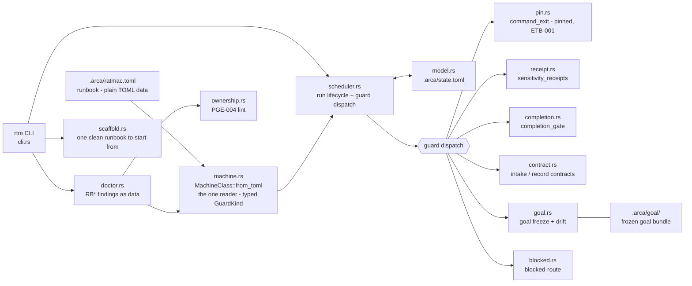

# ratmac

ratmac (`rtm`) is a Rust engine that runs agent work as an explicit state
machine. A runbook (`.arca/ratmac.toml`, plain TOML) declares phases,
prompts, guards, and transitions; the Engine instantiates it into a Run and
is the only writer of run state. Progress is proven by machine-checked
guards over artifacts on disk - never by an agent's claim. Deterministic and
offline: no network, no installs, no hidden global state.

Consult this file first, every time: the map below orients you; the routes
table locates every file; then read the file itself. The map is orientation
only, **never evidence** - a residual may not cite it.

**Where are we?** Derived from the tree, never declared - check in order:
open tickets in `.arca/ticket/` -> P4/P5 (building); `missing|partial`
residuals without tickets -> P3; goal frozen but residuals stale -> P2;
`pending` issues -> P1; none of the above -> Idle. (`.arca/state.toml`
answers only for a live `rtm` Run; until the P-cycle is the real runbook -
see steering.md, Current sprint endpoint - the tree is the oracle.)

## Map - how ratmac hangs together

Stamped cache - describes `18c8fe8` plus t-057, surveyed 2026-07-28 from a
read-only pass of src/ and test/. Refresh at each cycle close (gap check
green).

### Architecture

### Binary

`rtm` - hand-rolled CLI (`src/cli.rs`, no clap): `start`, `status`, `step`,
`hold`, `abandon`, `doctor`, `scaffold`. `doctor` is read-only and deep: parse,
graph, guard lint, and ownership passes over `MachineClass`, one `RB*` finding
per defect, `--json` for the finding list, and exit `0`/`1`/`2` for clean,
warnings, errors. `rtm doctor <path>` diagnoses any runbook file - an
unreadable path is the finding `RB101`, not a usage error. `rtm scaffold
<path>` writes the one runbook that starts clean.

### Modules (src/)

| Module | Role |
| :--- | :--- |
| `machine.rs` | `MachineClass::from_toml` - the whole runbook schema boundary and its only reader; hand-rolled over `toml::Value`, no serde. Rejects unknown keys (R-011), `status` anywhere (R-002/R-003), unknown guard kinds and wrong-field-for-kind (TRP-002/TRP-003). Retains every guard as a typed `GuardKind`. |
| `scheduler.rs` | Run lifecycle. Loads the typed class on every open/start/step/status and rebuilds the graph - fully data-driven, no phase names in src/. Guard dispatch matches on `GuardKind`. |
| `model.rs` | serde structs for `RunState`/`Status` (`.arca/state.toml`). |
| `pin.rs` | ETB-001: command guards run pinned code unless `exempt = true`. |
| `receipt.rs` | Sensitivity receipts; digests re-derived, self-verifying. |
| `completion.rs` | Completion gate: green + fresh via tree digest. |
| `contract.rs` | Intake/record contract gates; hard-codes `.arca/issue`, `.arca/residual`, `.arca/ticket` (R-016 debt). |
| `goal.rs` | Goal freeze and drift check (content hash of `.arca/goal/`). |
| `blocked.rs` | Blocked-route handling; hard-codes `.arca` paths (R-016 debt). |
| `ownership.rs` | PGE-004 ownership lint over prompts and guard contracts; the doctor's fourth pass. |
| `doctor.rs` | DRD-001..007: findings as data. Diagnoses through `machine.rs` and never walks runbook TOML itself; owns the graph and guard-lint passes, the JSON rendering, and the exit-code mapping. |
| `scaffold.rs` | AAL-002: the smallest doctor-clean runbook, written at a path that does not exist yet. One file, no options, never overwrites. |

### Runbook shape (`.arca/ratmac.toml`)

Defined once, in [runbook-spec.md](runbook-spec.md): top level, Phase and
transition fields, the closed guard-kind vocabulary with each kind's required
and optional fields, the ownership rules, and the `RB*` diagnostic codes. This
map deliberately keeps no copy - a second copy would be a second schema.

Two guards are not runbook kinds: goal drift against the frozen revision hash
is implicit, and no git-state kind exists - only `command_exit` reaches tree
state.

### Tests

`test/qa/` cargo crate, suites t011-t058. Wording surfaces (caller policy,
schema rules) are asserted against `.arca/schema.md` and `AGENTS.md`. Hidden
lane in `.arca-private/`, listed per ticket. Opt-in release lane:
`RATMAC_RELEASE_ACCEPTANCE=1`.

### Debts (the current sprint targets these - steering.md)

- Findings carry a location (`phase "build" guard 0`), never a line or span:
  an agent repairs by name, not by cursor position.
- R-016: `contract.rs`/`blocked.rs`/`goal.rs` bake in `.arca/*` paths.

## Read next

| You want | Read |
| :--- | :--- |
| Where we are heading; the lines no work may cross | [steering.md](steering.md) |
| How to contribute: loop, tickets, evidence - **binding** | [schema.md](schema.md) |
| What happened lately | [log.md](log.md) tail |

## Where things live

All agent routing and documentation must use these paths.

| Path | What lives there |
| :--- | :--- |
| `.arca/steering.md` | Direction and guardrails: thesis, invariants, non-goals; first re-aligned on a pivot. |
| `.arca/schema.md` | The working rules - binding for every contributor. |
| `.arca/runbook-spec.md` | What a runbook **is** - the one definition of the Machine Class format, guard kinds, ownership, and `RB*` diagnostics. |
| `.arca/runbook-authoring.md` | How to write one - scaffold, edit, `rtm doctor --json`, repair by code. Procedure only; every schema fact is a link into the specification. |
| `.arca/dict.md` | Glossary - plain-word definitions; consult before coining a term, add an entry when introducing one. |
| `.arca/goal/` | The goal bundle now in force (`spec.md` > `design.md` > `test-list.md`, plus `ubi-lang.md`, `index.md`). Frozen per Run. |
| `.arca/issue/<issue-id>/` | One incoming issue, exactly five files (shape: schema.md, "The issue folder"). |
| `.arca/residual/` | Gap records, one per requirement - proven yet? |
| `.arca/ticket/` | Small self-contained work units, cut from gap records. |
| `.arca/state.toml` | Run state - written ONLY by `rtm`; everyone else reads. |
| `.arca/log.md` | Append-only history; every landing leaves a line. |
| `.arca/tpl/` | Blank forms; a form filled in at its proper path is the real thing. |
| `.arca/vis/` | Shared pictures and graphs. |
| `.arca-private/` | Hidden test code, out of git, listed by its owning ticket. |
| `test/` | The runnable suite plus `test/test-list.md`. |
| `src/` | The Engine - mapped above. |

## Bootstrap

    pwsh -File tools/rtm.ps1   # resolve (or build) and pin-check the Engine
    rtm doctor                 # orient: engine identity, runbook, run state

Details, caller policy, and everything binding: [schema.md](schema.md).
