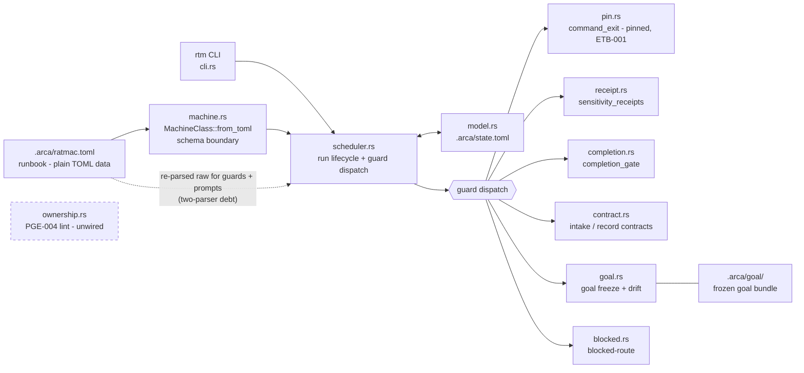

# ratmac

ratmac (`rtm`) is a Rust engine that runs agent work as an explicit state
machine. A runbook (`.arca/ratmac.toml`, plain TOML) declares phases,
prompts, guards, and transitions; the Engine instantiates it into a Run and
is the only writer of run state. Progress is proven by machine-checked
guards over artifacts on disk - never by an agent's claim. Deterministic and
offline: no network, no installs, no hidden global state.

Consult this file first, every time: the map below orients you; the routes
table locates every file; then read the file itself. The map is orientation
only, **never evidence** - a residual may not cite it.

## Map - how ratmac hangs together

Stamped cache - describes `debace8`, surveyed 2026-07-27 from a read-only
pass of src/ and test/. Refresh at each cycle close (gap check green).

### Architecture

### Binary

`rtm` - hand-rolled CLI (`src/cli.rs`, no clap): `start`, `status`, `step`,
`hold`, `abandon`, `doctor`. `doctor` is read-only and currently shallow
(bare TOML syntax check, not the real parser - see Debts).

### Modules (src/)

| Module | Role |
| :--- | :--- |
| `machine.rs` | `MachineClass::from_toml` - the whole runbook schema boundary; hand-rolled over `toml::Value`, no serde. Rejects unknown keys (R-011) and `status` anywhere (R-002/R-003). Discards guards (see Debts). |
| `scheduler.rs` | Run lifecycle. Re-reads `.arca/ratmac.toml` on every open/start/step/status and rebuilds the graph - fully data-driven, no phase names in src/. Guard dispatch lives here. |
| `model.rs` | serde structs for `RunState`/`Status` (`.arca/state.toml`). |
| `pin.rs` | ETB-001: command guards run pinned code unless `exempt = true`. |
| `receipt.rs` | Sensitivity receipts; digests re-derived, self-verifying. |
| `completion.rs` | Completion gate: green + fresh via tree digest. |
| `contract.rs` | Intake/record contract gates; hard-codes `.arca/issue`, `.arca/residual`, `.arca/ticket` (R-016 debt). |
| `goal.rs` | Goal freeze and drift check (content hash of `.arca/goal/`). |
| `blocked.rs` | Blocked-route handling; hard-codes `.arca` paths (R-016 debt). |
| `ownership.rs` | PGE-004 ownership lint - written, library-only, wired to no CLI command. |

### Runbook shape (`.arca/ratmac.toml`)

Top level: `phases`, `transitions` - nothing else. Per phase: `prompt`
(required string), `guards` (array of tables). Per transition: `from`, `to`,
`freeze = "goal"`, `blocked-route` (bool).

### Guard kinds

| kind | judges | trust |
| :--- | :--- | :--- |
| `files_exact` | directory listing equals `entries` | agent-controlled markers |
| `file_contains` | substring present in a file | agent-controlled content |
| `command_exit` | spawned program exit code; stderr bounded (ETB-002) | real; pinned via `pin.rs` unless `exempt` |
| `sensitivity_receipts` | evidence receipts, digest re-derived | self-verifying |
| `completion_gate` | completion receipts, green + fresh | tree-hash-anchored |
| `intake_contract` / `record_contract` | issue/residual/ticket shape, links, acyclic deps | structural |

Plus one implicit guard: goal drift against the frozen revision hash. No
git-state guard kind exists; only `command_exit` could reach tree state.

### Tests

`test/qa/` cargo crate, suites t011-t054. Wording surfaces (caller policy,
schema rules) are asserted against `.arca/schema.md` and `AGENTS.md`. Hidden
lane in `.arca-private/`, listed per ticket. Opt-in release lane:
`RATMAC_RELEASE_ACCEPTANCE=1`.

### Debts (the current thrust targets these - steering.md)

- Two parsers over one file: `MachineClass` discards guards; the scheduler
  re-parses raw TOML for guard evaluation and prompt rendering.
- `rtm doctor` validates syntax, not schema; no graph checks, no guard lint,
  no `--json`, no differentiated exit codes.
- Missing runbook yields a silent empty graph instead of a named refusal.
- Guard keys are one flat allowlist across all kinds - wrong-field-for-kind
  parses cleanly and fails only at step time.
- Errors are prose strings (no code, line, or span) - agents cannot repair
  from them.
- R-016: `contract.rs`/`blocked.rs`/`goal.rs` bake in `.arca/*` paths.

## Read next

| You want | Read |
| :--- | :--- |
| Where we are heading; the lines no work may cross | [steering.md](steering.md) |
| How to contribute: loop, tickets, evidence - **binding** | [schema.md](schema.md) |
| What happened lately | [log.md](log.md) tail |

## Where things live

All agent routing and documentation must use these paths.

| Path | What lives there |
| :--- | :--- |
| `.arca/steering.md` | Direction and guardrails: thesis, invariants, non-goals; first re-aligned on a pivot. |
| `.arca/schema.md` | The working rules - binding for every contributor. |
| `.arca/goal/` | The goal bundle now in force (`spec.md` > `design.md` > `test-list.md`, plus `ubi-lang.md`, `index.md`). Frozen per Run. |
| `.arca/issue/<issue-id>/` | One incoming issue, exactly five files (shape: schema.md, "The issue folder"). |
| `.arca/residual/` | Gap records, one per requirement - proven yet? |
| `.arca/ticket/` | Small self-contained work units, cut from gap records. |
| `.arca/state.toml` | Run state - written ONLY by `rtm`; everyone else reads. |
| `.arca/log.md` | Append-only history; every landing leaves a line. |
| `.arca/tpl/` | Blank forms; a form filled in at its proper path is the real thing. |
| `.arca/vis/` | Shared pictures and graphs. |
| `.arca-private/` | Hidden test code, out of git, listed by its owning ticket. |
| `test/` | The runnable suite plus `test/test-list.md`. |
| `src/` | The Engine - mapped above. |

## Bootstrap

    pwsh -File tools/rtm.ps1   # resolve (or build) and pin-check the Engine
    rtm doctor                 # orient: engine identity, runbook, run state

Details, caller policy, and everything binding: [schema.md](schema.md).
