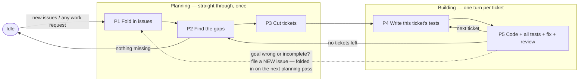

# Index

All agent routing and documentation must use these paths.

| Path                       | Role                                                                                                     |
| :------------------------- | :------------------------------------------------------------------------------------------------------- |
| `.arca/current/index.md`      | Goal front door: short summary plus links across the bundle.                                             |
| `.arca/current/ubi-lang.md`   | Words the goal uses, defined once.                                                                       |
| `.arca/current/spec.md`       | What the product must do — the deciding document for behavior.                                           |
| `.arca/current/design.md`     | How it is built, technically; must follow `spec.md`.                                                     |
| `.arca/current/test-list.md`  | The checks that prove the behavior: required checks, contract cases, state traces.                       |
| `.arca/tpl/`               | Blank forms only. A form filled in at its proper path is the real thing; the blank never is.             |
| `.arca/issue/<issue-id>/`  | One incoming issue: exactly five files (see The issue folder). Folder name = issue-id = `i-<nnn>-<slug>`. |
| `.arca/state.toml`         | Where the work stands right now; written ONLY by the scheduler `rtm` — agents read, never write (from `.arca/tpl/state.toml`).                                           |
| `.arca/log.md`     | Running history; new lines only, never edited (from `.arca/tpl/log.md`).                                 |
| `.arca/residual/`          | Gap records: one per requirement — is it proven yet? (from `.arca/tpl/residual.md`).                     |
| `.arca/ticket/`            | Small, self-contained pieces of work (from `.arca/tpl/ticket.md`).                                       |
| `.arca-private/`           | Hidden test code. Kept out of git; each ticket lists the hidden tests it owns.                           |
| `test/`                    | The test suite you can run (plus the `test/test-list.md` checklist).                                     |
| `.arca/vis/`               | Shared pictures and graphs.                                                                              |

# Two rule sets — read this first

There are two sets of rules. **They never limit each other.**

1. **Product rules** — `.arca/current/` (order of authority: `spec.md` > `design.md` > `test-list.md`). They say
   what ratmac-the-program does while it is running and handling a wish. They bind the program's behavior
   and what its tests expect — nothing else.
2. **Working rules** — this file. It says what a contributor (person or agent) does while building the
   program: gap records, tickets, tests, code.

If a goal sentence seems to forbid a working file (e.g. "no working files", "creates no code/tickets/tests"),
it is talking about the running program, never about your workspace (`.arca/residual/`,
`.arca/ticket/`, `.arca-private/`, `test/`, source code). When two rules seem to clash: decide by which set
each belongs to, add one log line (`conflict-resolved: <refs> — <one-line reason>`), and keep going. **A rule
clash is never a reason to stop work.**

# Entry — no magic words

Any user request that touches this work — an issue, a gap, a ticket, tests, code, a fix, a test run — **is**
an entry. Start at the nearest step and catch up the earlier ones yourself: check each earlier step's finish
line; if it is unmet, produce the missing piece yourself, minimally. Never ask the user to run a step.

| User intent (examples)                                                         | Enter at |
| :----------------------------------------------------------------------------- | :------- |
| "new issue", "integrate the issues"                                             | P1       |
| "what's missing", "where are the gaps"                                          | P2       |
| "plan the work", "cut tickets"                                                  | P3       |
| "write/implement the tests", "implement the rust tests from test/test-list.md"  | P4       |
| "implement", "fix", "run QA"                                                    | P5       |

`start issue loop` still works (enters P1). Once entered, run on your own all the way through the build loop
without prompting. Return to Idle when no gap record says `missing` or `partial`, or when the user says stop.

# Never get stuck — the answer ladder

`blocked` is a status only the scheduler sets (missing entry prerequisites, .arca/current/design.md, ADR-0006) — never your reason to stop. When something you need is missing, in this order:

1. **Work it out** from the defaults table or from how the repo already does things.
2. **Pick the safest reasonable value**; log `assumed: <what> — <why>`; keep going. A guess can be undone:
   if the user corrects it, redo the affected pieces — don't start over.
3. **Ask** — put every open question into one message, and meanwhile keep doing all work that does not
   depend on the answers. Put the open question in that one message; when entry prerequisites are missing, `rtm` records them in `blocker` in `state.toml`.

An unanswered question pauses only the piece that needs it, never the whole.

## Defaults

| Input                        | Default                                                                                        |
| :--------------------------- | :--------------------------------------------------------------------------------------------- |
| Goal freeze                  | Note the current git HEAD of `.arca/current/` as the frozen version. Writing that note IS the freeze. |
| Ticket approval              | Approved the moment it is created. The user may say `hold t-<id>` to pause that one ticket.    |
| `test_root`                  | `test/` (Rust harness: cargo test crate under `test/qa/`; create it if absent).                |
| `discovery_command` / `run_command` | By language — Rust: `cargo test`; otherwise look at the repo and pick.                  |
| `fixture_setup`              | Copies of test data in a temp folder, kept separate per test; none when not needed.            |
| `private_artifact_root` (hidden tests) | `.arca-private/` (kept out of git), created when first needed.                       |

# The work — one straight pass, then a loop

The work has two parts with different shapes:

- **Planning (P1 → P2 → P3)** runs **straight through, once**, each time new issues come in. It never loops.
  Many issues become one frozen goal, the goal is compared against reality, and each gap becomes one ticket.
- **Building (P4 → P5)** is **a loop: one full turn per ticket**. This is where nearly all the time goes.
  For each ticket: write its tests, try to poke holes in them, write the code, run everything, fix until
  green, review, take the next ticket.

The two parts meet at the gap check (P2). When the last ticket is done, do the gap check again: nothing
missing → rest (Idle). Something still missing → cut more tickets and keep building. The gap check is how the
loop knows when it is finished.

**The only road back:** if, while building, you find the goal itself is wrong or incomplete — do **not**
touch the goal. Write a **new issue** into `.arca/issue/`. It gets folded in on the next planning pass. From
the moment the goal is frozen until the last ticket is done, the goal does not move.

## The issue folder

- Each direct child of `.arca/issue/` is a folder holding exactly five files created from `.arca/tpl/issue/`:
  `index.md` (front door: identity, where it came from, status, links), `ubi-lang.md` (issue-specific words,
  or `No issue-specific terms.`), `spec.md` (what is asked for, plus what was decided about each ask),
  `design.md` (suggested how — carries no weight until folded into the goal), `test-plan.md` (how to prove it
  works, plus traces).
- Naming: folder name = `issue-id` = `i-<nnn>-<condensed-name>` — zero-padded number plus a short dashed name
  taken from the title (2–4 words, e.g. `i-007-continuous-qa`). `<nnn>` alone guarantees uniqueness and
  order; the name part is set at creation and does not change if the title changes later.
- `index.md` front matter: `issue-id` equal to the folder name, non-empty origin, status
  `pending|integrated|rejected`; relative links to the other four files; no unfilled template blanks.
- The schema gate is mechanized by `rtm` Exit Guards; agents don't hand-run it. See .arca/current/design.md, ADR-0006 and ADR-0009.
  A failed check is a **fix you do right away**, not a stop; log the check and the fix.
- Creating an issue is a direct act: write the five files from the blanks, run the shape check, done. It
  enters no loop step and touches neither `.arca/state.toml` nor `.arca/log.md`; the next planning pass folds it in.

## The steps (P1–P5)

**Planning — straight through, once per batch of issues:**

| Step                  | Does                                                                                                             | Finish line                                                                          |
| :-------------------- | :--------------------------------------------------------------------------------------------------------------- | :----------------------------------------------------------------------------------- |
| **P1** Fold in issues | Work every `pending` issue into the goal: give each ask a stable requirement ID and a decision `accepted|rejected|duplicate|deferred`, link everything both ways; shape check | Every issue ends `integrated|rejected`; all links resolve (fix them yourself, don't set them aside) |
| **P2** Find the gaps  | Freeze the goal (note git HEAD), then compare each requirement against what actually exists; write one record in `.arca/residual/` per requirement: `missing|partial|satisfied`, with pointers to the proof and a short why | Every requirement has exactly one record; no proof ⇒ never `satisfied`               |
| **P3** Cut tickets    | Turn each `missing|partial` record into one small, self-contained, provable piece of work in `.arca/ticket/` (from `.arca/tpl/ticket.md`); order them so a ticket that needs another comes after it; **approved on creation** | Each such record ↔ exactly one ticket; all links resolve                             |

**Building — one full turn per ticket, in order:**

| Step                            | Does                                                                                                             | Finish line                                                                          |
| :------------------------------ | :--------------------------------------------------------------------------------------------------------------- | :----------------------------------------------------------------------------------- |
| **P4** Write this ticket's tests | Turn the ticket's planned checks (planned-test-ID → test function, recorded in the ticket) into runnable tests; then re-read them trying to poke holes: would they catch a wrong answer, do they cover the edges, does each stand alone; run them — they should fail, since the code is not written yet | Every planned check for this ticket runs as a real test; hole-poking notes logged    |
| **P5** Write the code           | Implement; run **every test so far** (all earlier tickets' plus this one's); run the hidden test lanes (test code in `.arca-private/`, listed in the ticket with `hidden-id`, `goal-contract-ref`, `category`, `oracle`, `owner`); fix and re-run until all green; short review; take the next ticket | All tests green including hidden lanes. No tickets left → redo P2's gap check → Idle when nothing is `missing|partial` |

Hidden/breaking test lanes (run inside P5's full test run; frozen versions, separate test data, recorded
random seeds; one coordinator merges results by fingerprint and keeps the artifacts — a result that
contradicts another gets a log line plus a follow-up ticket, not a stop):

| Lane                | Owns                                                                                     |
| :------------------ | :---------------------------------------------------------------------------------------- |
| Regression          | Things that once worked still work; settled issues stay settled                          |
| Input/Routing       | Malformed and hostile input, parsing edges, and input reaching the right handler         |
| Lifecycle/Model     | Objects move between states only in allowed ways; not crash/restart concerns             |
| Durability/Recovery | Crashes, restarts, and coming back up with nothing lost                                  |
| Output/Filesystem   | Issue folder shape, required files, relative links, never touching user files, writing only where allowed |
| Cross-Feature       | Two or more features used together                                                       |

# State

- `.arca/state.toml`: `phase`, `status: planned|executing|blocked|passed|failed`, versions in play,
  `blocker` (the missing entry prerequisite recorded by `rtm` — nothing else).
- `.arca/log.md`: new lines only, never edited; one line per step change, guess, rule-clash
  decision, or fix.

# Rule

Do:

- Enter on any work-shaped request; catch up missing earlier steps yourself.
- Prefer work-it-out > safe guess > ask; log every guess; put all questions in one message.
- Write each ticket's tests in P4, before its code. Keep hidden test code in `.arca-private/`, listed in the
  owning ticket.
- Fill in real files from the blanks in `.arca/tpl/`; keep `.arca/log.md` new-lines-only.
- Found a goal problem mid-build? File a new issue in `.arca/issue/` — that is the only road back.

Don't:

- Don't apply `.arca/current/` product rules to working files — decide by rule set and keep going.
- Don't write state yourself — only `rtm` writes `state.toml`; `blocked` marks missing entry prerequisites only (.arca/current/design.md, ADR-0006).
- Don't mark a gap record `satisfied` without proof.
- Don't edit the frozen goal while tickets are open.
- Don't stop on failed checks or rule clashes — fix, log, keep going.

# Worked example

User: "I want to implement the rust tests based on test/test-list.md" →

1. Route: **P4**. Catch up: P1 (fold in any `pending` issues, else log the skip) → P2 (freeze = note git
   HEAD; write one gap record per requirement) → P3 (one approved ticket per `missing|partial` record).
2. Loop, one ticket at a time: **P4** — create the `test/qa/` cargo crate if absent; write one `#[test]` per
   TP/CT mapping recorded in the ticket; poke holes in your own tests; `cargo test` (failing is expected).
   **P5** — write the code; `cargo test` full suite; hidden-lane pass; fix; review; next ticket.
3. No tickets left → redo the gap check → Idle.

Zero questions unless something truly cannot be worked out — then one batched message while every independent
piece keeps moving.
