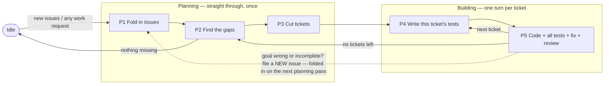

# Schema - the working rules

This file **binds** contributors (human or agent): the planning pass, the
build loop, issues, gap records, tickets, evidence, ownership, bootstrap,
trials. It is law, not orientation.

To locate anything - paths, the project manifest, steering, the system map -
read [index.md](index.md): that is the index; this is the schema it points to.

# Two rule sets — read this first

There are two sets of rules. **They never limit each other.**

1. **Product rules** — `.arca/goal/` (order of authority: `spec.md` > `design.md` > `test-list.md`). They say
   what ratmac-the-program does while it is running and handling a wish. They bind the program's behavior
   and what its tests expect — nothing else.
2. **Working rules** — this file. It says what a contributor (person or agent) does while building the
   program: gap records, tickets, tests, code.

If a goal sentence seems to forbid a working file (e.g. "no working files", "creates no code/tickets/tests"),
it is talking about the running program, never about your workspace (`.arca/residual/`,
`.arca/ticket/`, `.arca-private/`, `test/`, source code). When two rules seem to clash: decide by which set
each belongs to, add one log line (`conflict-resolved: <refs> — <one-line reason>`), and keep going. **A rule
clash is never a reason to stop work.**

# Plain words — how to write here

Binds every response, file, commit message, and log line. A reader must never need a decoder.

- **Name things; do not cite hashes.** A commit is "the review-corrections landing", not `2abaec4`. A hash is
  written only *inside* a command the reader is meant to run, or in a field that requires one (a history
  line's short hash, a goal freeze stamp). Never as a name, and never as a helpful aside — handing over a
  hash "in case you need it" is citing it. If the reader might need to act on a commit, write the whole
  command.
- **No short form on first use in a response.** Write the words, then the short form once in parentheses if
  it will repeat: "planning step 1 (P1)". A dict.md entry licenses a term inside documents, where the
  glossary sits one click away; it never licenses a bare short form in conversation.
- **No short form dict.md does not define.** A new one earns its dict.md entry in the same landing (see the
  `Requirement ID` entry), or it is not used at all.
- **An id follows its plain name in the same sentence and never stands alone** — "the authoring-loop ticket
  (`t-057`)". An issue or a gap record is named by what it is about, never by its number: "the issue about
  running the cycle as a runbook (`i-015`)", and the number only when the reader has to find the folder.
- **Plain sentence first, mechanism after.** Say what is true or what changed in ordinary words; paths,
  codes, and command names come next, as support.

A sentence the reader cannot follow is a defect like any other: rewrite it, no log line needed.

# Entry — no magic words

Any user request that touches this work — an issue, a gap, a ticket, tests, code, a fix, a test run — **is**
an entry. Start at the nearest step and catch up the earlier ones yourself: check each earlier step's finish
line; if it is unmet, produce the missing piece yourself, minimally. Never ask the user to run a step.

| User intent (examples)                                                         | Enter at |
| :----------------------------------------------------------------------------- | :------- |
| "new issue", "integrate the issues"                                             | P1       |
| "what's missing", "where are the gaps"                                          | P2       |
| "plan the work", "cut tickets"                                                  | P3       |
| "write/implement the tests", "implement the rust tests from test/test-list.md"  | P4       |
| "implement", "fix", "run QA"                                                    | P5       |

`start issue loop` still works (enters P1). Once entered, run on your own all the way through the build loop
without prompting. Return to Idle when no gap record says `missing` or `partial`, or when the user says stop.

# Never get stuck — the answer ladder

`blocked` is a status only the scheduler sets (missing entry prerequisites, .arca/goal/design.md, ADR-0006) — never your reason to stop. When something you need is missing, in this order:

1. **Work it out** from the defaults table or from how the repo already does things.
2. **Pick the safest reasonable value**; log `assumed: <what> — <why>`; keep going. A guess can be undone:
   if the user corrects it, redo the affected pieces — don't start over.
3. **Ask** — put every open question into one message, and meanwhile keep doing all work that does not
   depend on the answers. Put the open question in that one message; when entry prerequisites are missing,
   `rtm` records them in `blocker` in the addressed Run's `.ratmac/runs/<run-id>/run.toml`.

An unanswered question pauses only the piece that needs it, never the whole.

## Defaults

| Input                        | Default                                                                                        |
| :--------------------------- | :--------------------------------------------------------------------------------------------- |
| Goal freeze                  | Note the current git HEAD of `.arca/goal/` as the frozen version. Writing that note IS the freeze. |
| Ticket approval              | Approved the moment it is created. The user may say `hold t-<id>` to pause that one ticket.    |
| `test_root`                  | `test/` (Rust harness: cargo test crate under `test/qa/`; create it if absent).                |
| `discovery_command` / `run_command` | By language — Rust: `cargo test`; otherwise look at the repo and pick.                  |
| `fixture_setup`              | Copies of test data in a temp folder, kept separate per test; none when not needed.            |
| `private_artifact_root` (hidden tests) | `.arca-private/` (kept out of git), created when first needed.                       |

## Units and git

One commit = one landing = one log.md line. A landing is the smallest provable step; its log line cites the
short hash. Larger units line up with git like this:

| Unit        | Git shape                                              | Link                                                                                 |
| :---------- | :----------------------------------------------------- | :----------------------------------------------------------------------------------- |
| Landing     | one commit                                             | one log.md line citing the short hash                                                |
| Ticket      | a contiguous run of commits ending green in its ticket worktree; the ticket branch merges into `main` at green | commits prefixed `t-<id>:`; the ticket file records its final hash. The red commit (tests exist, fail) and the green commit (all pass) are its two required landings |
| Goal freeze | a recorded HEAD hash of `.arca/goal/`                  | the freeze note (see Defaults) — writing it IS the freeze                            |
| Residual    | none — a judgment about a frozen HEAD                  | cites commit hashes as evidence                                                      |
| Sprint      | trunk from the freeze HEAD to the clean-gap-check commit, then pushed to `origin` at Idle | the sync (see cycle-end git discipline below)                                        |
| Issue       | none — issues precede code                             | folded in at the next planning pass                                                  |

One stated exception to the identity above: during a build turn's deliberate-damage checks, the ephemeral
safety commit — subject exactly `t-<id>: checkpoint - not a landing` — is not a landing and takes no
log line. It is unpublished and unmerged, and `git commit --amend` replaces it with the green landing
before the merge, so permanent ticket-branch history keeps the identity intact (see
[Deliberate damage and discard safety](#deliberate-damage-and-discard-safety)).

Two lanes decide what must enter the loop:

- **Program lane** — anything changing what the program does (`src/`, tests, the runbook): no commit without
  a ticket. Work enters as issue → goal → residual → ticket.
- **Shop lane** — `.arca` docs (steering, schema, index, dict, tpl, vis): lands directly, steering first on
  pivots, one log line per landing (issue creation excepted — see "The issue folder").

Cycle-end git discipline — three duties close every build cycle:

- **Ticket worktrees.** Every build turn runs in a linked worktree on a ticket branch named after its
  ticket (`t-<id>-<slug>`, e.g. `t-063-run-completion`). Its landings happen there; when the turn ends green, the ticket
  branch merges into `main` — fast-forward when `main` has not moved, otherwise one merge commit that is
  itself a landing with its own log line — then `.arca-private/` copies back (next duty), and only then
  are the worktree and branch removed. A cycle never closes
  with a live ticket worktree. A ticket worktree is not a trial worktree: a trial branch never merges
  into `main` (see Trial worktrees), and nothing here changes that.
- **Hidden lanes travel with the turn.** `.arca-private/` is untracked (gitignored), so a fresh ticket
  worktree does not contain it, and each hidden crate's `ratmac = { path = "../.." }` resolves to
  whichever checkout holds the crate. At turn start, copy `.arca-private/` from the primary checkout
  into the ticket worktree, skipping each crate's `target/` build output; author the new ticket's
  hidden crate inside that copy; run every hidden lane from inside the worktree, so the lanes test
  the branch code, never the pre-turn `main`. At green the order is fixed: merge first; copy
  `.arca-private/` back to the primary checkout second — before any removal, because the new crate is
  gitignored and committed nowhere, so removing the worktree first destroys its only copy; remove the
  worktree and branch third; re-run the hidden lanes once from `main` last — the post-merge confirmation.
- **Sync at Idle.** A cycle is complete only when its landings are on the remote: after the clean gap
  check lands and every ticket worktree is merged, push `main` to `origin` (a plain push, never a force
  push). Resting at Idle with unpushed landings is a defect. The push is a sync, never a deploy; the
  trial lifecycle stays offline as before.

# The work — one straight pass, then a loop

The work has two parts with different shapes:

- **Planning (P1 → P2 → P3)** runs **straight through, once**, each time new issues come in. It never loops.
  Many issues become one frozen goal, the goal is compared against reality, and each gap becomes one ticket.
- **Building (P4 → P5)** is **a loop: one full turn per ticket**. This is where nearly all the time goes.
  For each ticket: write its tests, try to poke holes in them, write the code, run everything, fix until
  green, review, take the next ticket.

The two parts meet at the gap check (P2). When the last ticket is done, do the gap check again: nothing
missing → merge any live ticket worktree, push `main` to `origin` (Units and git: cycle-end git
discipline), rest (Idle). Something still missing → cut more tickets and keep building. The gap check is
how the loop knows when it is finished.

**The only road back:** if, while building, you find the goal itself is wrong or incomplete — do **not**
touch the goal. Write a **new issue** into `.arca/issue/`. It gets folded in on the next planning pass. From
the moment the goal is frozen until the last ticket is done, the goal does not move.

## Steering layers

`.arca/steering.md` binds by three layers, hardness strictly increasing top to bottom; each carries its own
update clock:

- **Authored identity** — What we are building, Ideal shape, Thesis, Invariants, Non-goals. Changes only on a
  pivot and lands **first**, before any dependent change in `.arca/goal/`, `.arca/issue/`, `.arca/ticket/`
  (see Units and git, shop lane). **Ideal shape** is the destination the rest of the file serves: the
  properties the finished system has, as prose only — no requirement IDs, no dates, no ordering (that is
  Horizon), no measurement of distance (that is the gap check). It is direction, never evidence: a residual
  may not cite it and no ticket is ever cut from it. Its one mechanical use is the P1 admission test below.
- **Horizon** (forecast) — an authored ordering of directions beyond the current sprint, in direction/wish/
  issue terms only: no ticket terms, nothing executable. Binds nothing; nothing in it is chosen; no work is
  ever cut straight from it — an item is chosen only by going through P1 like any other issue, never by
  promoting a horizon item in place. Revised freely at any time; its natural moment is right after each P1
  close, once landings have re-priced the pool.
- **Current sprint** (derived) — written at exactly one moment: P1 close, after human dispositions sign the
  batch and the goal absorbs it. Regenerated wholesale from the accepted issue set; incremental hand-edits
  are forbidden (a hand-patched derived record is authored narration in costume). Carries a freeze stamp —
  goal git HEAD + the P1 date — so staleness is self-declaring; no clearing at sprint end, the next P1
  replaces it. Never written during P4–P5; progress or status is never recorded here (stage derivation reads
  the tree: open tickets, gap records, log lines). Route content is an ordered dependency list of the signed
  sprint only — what depends on what, one why per edge, never dates or task breakdowns; every route entry
  must trace to an issue accepted at the stamped P1.

Alongside the layers, **Open questions** — forks written down but not decided. Each is a choice of
mechanism, never of destination: every Ideal-shape property must hold whichever way the fork goes. Binds
nothing; nothing in it is chosen; no work is ever cut from it. Written the moment a fork is spotted, deleted
the moment it is answered — the answer lands as an Ideal-shape property, a goal requirement, or a new issue.
A fork nobody wrote down is drift.

## The issue folder

- The issue namespace has three physical locations. `.arca/issue/<issue-id>/` is the intake work area for a
  newly created or explicitly selected issue; `.arca/issue/deferred/<issue-id>/` is the live waiting buffer
  for an issue with at least one deferred ask; `.arca/issue/archive/<issue-id>/` is completed history. Every
  issue location holds the same exact five-file bundle created from `.arca/tpl/issue/`: `index.md` (front
  door: identity, where it came from, status, links), `ubi-lang.md` (issue-specific words, or
  `No issue-specific terms.`), `spec.md` (what is asked for, plus what was decided about each ask),
  `design.md` (suggested how — carries no weight until folded into the goal), and `test-plan.md` (how to
  prove it works, plus traces).
- Naming: folder name = `issue-id` = `i-<nnn>-<condensed-name>` — zero-padded number plus a short dashed name
  taken from the title (2–4 words, e.g. `i-007-continuous-qa`). `<nnn>` alone guarantees uniqueness across
  intake, deferred, and archive; the name part is set at creation and does not change if the title changes.
- `index.md` front matter: `issue-id` equal to the folder name, non-empty origin, status
  `pending|deferred|integrated|rejected`; relative links to the other four files; no unfilled template
  blanks. Location is authoritative for waiting versus completed work and the status is its checked mirror:
  a bundle under `deferred/` has status `deferred`, while a bundle under `archive/` has status `integrated`
  or `rejected`.
- A deferred ask is unresolved work, including when sibling asks were accepted. Any issue whose `spec.md`
  contains a `deferred` disposition stays whole under `deferred/`; it is never archived and no replacement
  issue is minted. Selecting it again visibly moves the same bundle to the intake work area and changes its
  status to `pending`; required relative-link rewrites travel with that move.
- The schema gate is mechanized by `rtm` Exit Guards; agents don't hand-run it. See .arca/goal/design.md,
  ADR-0006 and ADR-0009. A failed check is a **fix you do right away**, not a stop; log the check and the fix.
- Creating an issue is a direct act: write the five files from the blanks under `.arca/issue/<issue-id>/`
  with status `pending`, run the shape check, done. It enters no loop step and touches neither the
  Engine root `.ratmac/` nor `.arca/log.md`; the next planning pass folds it in.

## The wishlist

`.arca/wishlist.md` is the capture side of planning: unordered ideas with zero commitment, and only a
human promotes one. Filing is deliberately cheap, so nothing an observer notices has to wait for a
human to ask for it.

- **The Advisor files its own wishes.** An Advisor that sees the build system itself misbehave — wasted
  rework, a rule nothing enforces, a defect class found by hand twice — records it when it sees it, by
  dispatching one Subagent whose whole job is to append the wish to `.arca/wishlist.md` on `main`. It
  never parks the note in conversation and waits to be polled. Wishes accumulated during a ticket turn
  are flushed at the next turn boundary at the latest: a ticket landing, a review verdict, or the end
  of the session.
- **One wish per actionable observation**, one line, in the file's existing shape:
  `- **<desired end, in plain words>** — <author>, <YYYY-MM-DD>. Evidence: <what makes it checkable>.
  Desired end: <what good looks like>.` No fix design, no requirement ID, no ticket, no ordering.
- **Evidence, not claim.** A Run status, an agent's assertion, or content writable by the agent under
  test is never evidence by itself; cite the command, receipt, review, artifact, or file and line.
- **Append only, and read before you write.** The Subagent reads the whole file first: if a live wish
  already covers the observation, it strengthens that entry with the new evidence instead of adding a
  second carrier. Other authors' live wishes are never reordered, reworded, or deleted. Several
  observations go in one append, not one per message.
- **A fulfilled wish leaves the file.** The wishlist holds open wishes only. When a wish's desired end
  lands, the landing that fulfilled it deletes its entry in the same commit - it is never kept and
  marked `fulfilled`. Its trail stays where history is kept: the landing line in `.arca/log.md`, the
  archived issue bundle that carried it, and the gap records those tickets cite. A wish only partly
  landed stays, with the landed part recorded in its own entry.
- **Subagent scope.** That Subagent writes `.arca/wishlist.md` and nothing else — no code, no tests, no
  issue, no ticket, no goal edit, no `rtm`, no branch or worktree operation.
- **Filing is not promotion.** Appending a wish starts no step, mints no issue, and forces no P1; it
  earns no `.arca/log.md` line and rides the session's next ordinary commit. A human promoting a wish
  marks the promotion in place; a wish whose work has landed is deleted instead, by the landing that
  fulfilled it, under "A fulfilled wish leaves the file" above.

## The steps (P1–P5)

**Planning — straight through, once per batch of issues:**

| Step                  | Does                                                                                                             | Finish line                                                                          |
| :-------------------- | :--------------------------------------------------------------------------------------------------------------- | :----------------------------------------------------------------------------------- |
| **P1** Fold in issues | Work every `pending` issue in the intake work area into the goal or the working authority: give each ask a stable requirement ID and a decision `accepted|rejected|duplicate|deferred`, link everything both ways — an accepted ask resolves either to a product requirement row in `.arca/goal/spec.md` or to an explicit requirement-ID heading in the working authority (this file), and a working-authority requirement mints no goal row and binds at integration; it mints a gap record and a ticket only when it carries an executable deliverable, as the edition requirements do ([Editions](#editions)); name, per accepted issue, the Ideal-shape property it advances — an issue that advances none and defers nothing is `rejected`, or it is a pivot, and then steering changes first and the issue waits for the next pass; shape check | An issue with any deferred ask moves whole to `.arca/issue/deferred/` with status `deferred`; every other issue ends `integrated|rejected`; every integrated issue has at least one accepted or duplicate ask, every accepted requirement exists in the goal or under its requirement-ID heading in the working authority, and each accepted issue names the shape property it advances; all live links resolve |
| **P2** Find the gaps  | Freeze the goal (note git HEAD), then compare each requirement against what actually exists; write one record in `.arca/residual/` per requirement: `missing|partial|satisfied`, with pointers to the proof and a short why | Every requirement has exactly one record, active and archive counted together; no proof ⇒ never `satisfied` |
| **P3** Cut tickets    | Turn each `missing|partial` record into one small, self-contained, provable piece of work in `.arca/ticket/` (from `.arca/tpl/ticket.md`); order them so a ticket that needs another comes after it; **approved on creation** | Each such record ↔ exactly one ticket; all links resolve                             |

**Building — one full turn per ticket, in order:**

| Step                            | Does                                                                                                             | Finish line                                                                          |
| :------------------------------ | :--------------------------------------------------------------------------------------------------------------- | :----------------------------------------------------------------------------------- |
| **P4** Write this ticket's tests | Turn the ticket's planned checks (planned-test-ID → test function, recorded in the ticket) into runnable tests; then re-read them trying to poke holes: would they catch a wrong answer, do they cover the edges, does each stand alone; run them — they should fail, since the code is not written yet | Every planned check for this ticket runs as a real test; hole-poking notes logged    |
| **P5** Write the code           | Implement; run **every test so far** (all earlier tickets' plus this one's); run the hidden test lanes (test code in `.arca-private/`, listed in the ticket with `hidden-id`, `goal-contract-ref`, `category`, `oracle`, `owner`); fix and re-run until all green; then the deliberate-damage checks in the fixed order of [Deliberate damage and discard safety](#deliberate-damage-and-discard-safety): safety commit, each check from it, restore and verify, kills into the owning gap record, `git commit --amend` into the green landing; short review; take the next ticket | All tests green including hidden lanes, run from inside the ticket worktree; every deliberate-damage check run from the safety commit and the checkpoint amended into the green landing with its one log line; then in order: merge the ticket branch into `main`, copy `.arca-private/` back to the primary checkout, remove the worktree and branch, re-run the hidden lanes green from `main`. No tickets left → redo P2's gap check → nothing `missing|partial` → push `main` to `origin`, then Idle |



Hidden/breaking test lanes (run inside P5's full test run; frozen versions, separate test data, recorded
random seeds; one coordinator merges results by fingerprint and keeps the artifacts — a result that
contradicts another gets a log line plus a follow-up ticket, not a stop):

| Lane                | Owns                                                                                     |
| :------------------ | :---------------------------------------------------------------------------------------- |
| Regression          | Things that once worked still work; settled issues stay settled                          |
| Input/Routing       | Malformed and hostile input, parsing edges, and input reaching the right handler         |
| Lifecycle/Model     | Objects move between states only in allowed ways; not crash/restart concerns             |
| Durability/Recovery | Crashes, restarts, and coming back up with nothing lost                                  |
| Output/Filesystem   | Issue folder shape, required files, relative links, never touching user files, writing only where allowed |
| Cross-Feature       | Two or more features used together                                                       |

# Runtime layout

- **Engine root.** The shared runtime root is the primary checkout's `.ratmac/`; its
  Git-ignored runtime is `runs/`, `mint.toml`, `locks/`, and `log.md`.
- **Machine Class.** The invoking checkout reads its tracked `.ratmac/ratmac.toml`;
  receipts under `.ratmac/evidence/<run-id>/` stay tracked.
- **Per-Run Run Record.** `.ratmac/runs/<run-id>/run.toml` records `state`,
  `status: planned|executing|blocked|passed|failed`, versions in play, and `blocker`
  (the missing entry prerequisite recorded by `rtm` — nothing else).
- `.arca/log.md` is human-only append-only history: new lines only, never edited; one line per
  step change, guess, rule-clash decision, or fix.

## Engine namespace

`ENS-011`–`ENS-012` are working-authority requirements: accepted asks resolve to the headings
below and bind at integration while minting no goal row, gap record, or ticket.

### ENS-011 — current Engine addresses

Integrated from [issue i-024](issue/archive/i-024-engine-namespace-split/spec.md#requirement-records).

The working rules name no pre-split Engine path and no pre-cutover Run Record. `.arca/schema.md` and
[index.md](index.md) name the Engine root `.ratmac/`, its runtime contents, and the per-Run
Run Record `.ratmac/runs/<run-id>/run.toml` (renamed from the flat and per-Run `state.toml`
spellings by goal `SVC-004`). Archived and frozen records stay byte-for-byte unchanged.

### ENS-012 — Engine-root tracking policy

Integrated from [issue i-024](issue/archive/i-024-engine-namespace-split/spec.md#requirement-records).

Runtime files under `.ratmac/` — `runs/`, `mint.toml`, `locks/`, and `log.md` — are ignored by
Git, while the Machine Class `.ratmac/ratmac.toml` and receipts under
`.ratmac/evidence/<run-id>/` stay tracked. Live Run state can therefore never enter a ticket
branch or a merge, and run-scoped receipt paths keep two parallel child Runs from colliding on
the same receipt filename.

## State vocabulary

`SVC-009`–`SVC-010` are working-authority requirements: accepted asks resolve to the headings
below and bind at integration while minting no goal row, gap record, or ticket.

### SVC-009 — state vocabulary in the working rules

Integrated from [issue i-025](issue/archive/i-025-state-vocabulary/spec.md#requirement-records).

The working rules and the orientation they point at speak the settled vocabulary: `.arca/schema.md`,
[index.md](index.md), `.arca/dict.md`, `.arca/runbook-spec.md`, `.arca/runbook-authoring.md`,
`.arca/steering.md`, and the blank forms in `.arca/tpl/` name **State** (the position in the machine
graph), **Run Record** (the one file the Engine writes for one Run), **Run** (the whole live
instance), and `status` (Engine-owned lifecycle, never a position). The glossary's `Phase` entry is
replaced by entries for State and Run Record. Verified by a written check that every one of those
files reads in the settled vocabulary and that the blank Run Record form moves with the file and its
field.

### SVC-010 — renaming a term never rewrites history

Integrated from [issue i-025](issue/archive/i-025-state-vocabulary/spec.md#requirement-records).

`.arca/dict.md`'s rule "when a term is replaced, delete every mention of the old term" applies to
live documents only. Where it meets [Evidence and archive rules](#evidence-and-archive-rules) —
a completed record keeps its bytes — preservation wins: archived issue bundles, archived tickets,
archived gap records, and `.arca/log.md` keep the old wording exactly, and the glossary states this
in its own words. An audit proving no live surface carries a retired spelling enumerates those
historical carriers explicitly instead of skipping an unbounded set.

# Caller policy for `rtm`

One policy, and the same one on every surface (goal `ORS-001`, which supersedes the earlier rule reserving start for humans alone):

- A human may invoke argument-free `rtm start` directly.
- The Main-Agent may invoke `rtm start` only after explicit human Run-start sign-off for the current target project;
  conversational sign-off is enough, and nothing in the Engine records it.
- A Subagent never invokes any `rtm` command; it reads its assigned Run's Run Record and does the ticket work.
- Only the Main-Agent or the human invokes `rtm step`; the Scheduler stays the sole writer of
  `.ratmac/runs/<run-id>/run.toml`.

# Evidence and archive rules

These are durable working rules; the goal's `AOI-001`–`AOI-003` bind the program that mechanizes them.

- **Authorized archive move.** A completed issue folder — `index.md` status `integrated` or `rejected`,
  at least one accepted or duplicate ask when integrated, and no ask disposition `deferred` — may move to
  `.arca/issue/archive/<issue-id>/`, keeping its issue-id, its five-file shape, and its bytes, except relative
  links that must gain one `../` level. Live links pointing at it are updated in the same change, and issue
  numbers stay unique across intake, deferred, and archive. A complete move IS preservation: every history
  oracle compares content at the archived destination. A partial move, a content change, or archiving an
  issue that is pending or deferred is a failure. Links inside already archived records are frozen
  provenance, not live links, and are never rewritten when another issue later moves.
- **Authorized deferred restoration.** An issue with any ask disposition `deferred` lives at
  `.arca/issue/deferred/<issue-id>/`, including a mixed issue whose other asks were accepted. If an archived
  bundle is found with a deferred ask, the same complete five-file bundle moves to `deferred/` in one
  correction: `index.md` status changes to `deferred`, live inbound and outbound links are retargeted, and
  no other historical prose is rewritten. This visible restoration is preservation and reuses the issue id;
  a replacement issue or a second carrier for any deferred ask is a failure. Selecting the issue later
  moves that same bundle to the intake work area with status `pending`; if any ask remains deferred after
  P1, the bundle returns to `deferred/`.
- **Authorized residual archive move.** A residual record whose status is `satisfied` may move to
  `.arca/residual/archive/<record-name>`, keeping its name, its bytes, and its shape, except relative links
  that must gain one `../` level; links elsewhere pointing at it are updated in the same change. The active
  folder holds only open gaps (`missing|partial`); a reviewer reads active and archive as one namespace —
  exactly one record per requirement across both, and no-satisfaction-by-absence is judged over both: a
  record in archive is present, not absent. When a later gap check re-judges an archived requirement
  `missing|partial`, the same record moves back to the active folder in the same landing as the re-judgment —
  reopening is a visible move, never a new record minted for the same requirement; a chain of records for one
  requirement is a failure. A record carrying a pending obligation (e.g. a commit-hash re-stamp) may archive;
  the obligation travels with the file.
- **Authorized ticket archive move.** A ticket whose residual(s) all read `satisfied` and whose final hash is
  recorded may move to `.arca/ticket/archive/<ticket-file>`, on the same preservation terms: bytes, name, and
  shape kept, relative links gaining one `../` level, links in both directions updated in the same change. An
  archived ticket stays citable evidence, and ticket ids stay unique across active and archive. A ticket is
  never archived while any residual it owns is still `missing|partial`, or while it is `held`.
- **Reviewable snapshot.** Evidence may only claim what a reviewer can reconstruct. When you record acceptance or
  merge-gate evidence, every file under the declared evidence roots (`src/`, `test/`, `.arca/`) must be tracked or
  staged; anything untracked or unstaged is either committed, staged, or declared as an explicit exception in the
  record. Store the snapshot manifest — path, tracking state, SHA-256 — beside the evidence that cites it
  (`ratmac_qa::snapshot::record_snapshot`).
- **Append-only history.** `.arca/log.md` is the human-only history file that changes in place, and
  only by appending: its recorded prefix must survive byte for byte. A rewrite of any earlier line is a
  preservation failure, exactly like an edit to an archived issue file. A human contributor appends one
  line per closure. `rtm` never writes it; while a Run is active it records transitions only in
  `.ratmac/log.md`, which no agent writes.
- **Out-of-ticket trace.** Work landed outside the ticketed system — docs, config, tooling, harness edits — still
  appends one `- YYYY-MM-DD: <what landed, where, why>` line to `.arca/log.md` before the session ends. Subsequent
  sessions read the log first instead of reconstructing changes from `git diff`/history.
- **Release acceptance lane opt-in.** Environment-coupled release checks (live GitHub identity, exact origin, branch,
  clean worktree) run only with `RATMAC_RELEASE_ACCEPTANCE=1`. Plain `cargo test --workspace` skips that lane and
  prints the skip; never make branch work depend on operator-cutover facts.

## Deliberate damage and discard safety

Every gap record must cite the mutations that kill its tests, so every build turn briefly breaks the code
on purpose to watch a named test fail. This section is how that happens without ever risking completed
work. It binds the manual cycle this repository runs today; its machine enforcement — a guard refusing a
dirty tree — is owned by the cycle-as-runbook issue (`i-015`), not built here. `SDC-001`–`SDC-004` are
working-authority requirements: accepted asks resolve to the headings below, and they mint no goal row,
no gap record, and no ticket.

Provenance: in the composition-format turn (the archived ticket `t-064`), a mutation-evidence revert ran
`git checkout -- src/machine.rs` after the green build while the green implementation of that file was
uncommitted and never staged. The index still held the red bytes, so the command restored the red state
and destroyed the only copy, and the file had to be reconstructed from its tests. The lesson frozen in
that ticket's P5 notes — restore mutation probes from an explicit backup copy, never from git, while an
increment is uncommitted — is superseded by `SDC-002` below: with the safety commit, checkpoint-sourced
git restoration is the standard, and backup copies and hand-written inverse edits are not. The archived
notes stay byte-identical; this paragraph is where the supersession lives.

### SDC-001 — the discard guard

No contributor runs a discard command — `git checkout -- <path>`, `git restore`, `git clean`,
`git reset --hard`, dropping a stash, or any other command that throws away uncommitted changes — while
the working tree holds unsaved completed work. Before any discard: look (`git status`, then `git diff`
over anything it lists); whatever is wanted beyond what the discard is meant to remove is saved as a
commit or parked first (`git stash push -m "t-<id>: <what>"`, dropped only after its content lands or is
explicitly declared obsolete). `git clean` and `git reset --hard` are discard commands under this rule at
every moment. The rule bans discarding unsaved work, never version-control restoration: restoring saved
bytes from a checkpoint is standard and preferred.

### SDC-002 — damage only from a checkpoint

A deliberate-damage check runs only from the safety commit: after the turn's tests are all green, commit
everything with the subject exactly `t-<id>: checkpoint - not a landing`. That commit is ephemeral —
unpublished, unmerged, never a Landing, no log line. Damage is limited to paths the checkpoint already
tracks. Each undo restores index and worktree from the checkpoint —
`git restore --source=<checkpoint> --staged --worktree -- <paths>` — never plain `git restore <paths>`
or `git checkout -- <paths>`, which copy index bytes that may be stale (exactly the `t-064` failure),
and never `git clean`. After each restore, verify: `git status --porcelain` prints nothing and the tree
matches the checkpoint. Hand-written inverse edits are not the standard undo.

### SDC-003 — turn order and the single evidence home

The order inside the code-writing step (P5) is fixed: tests green → safety commit → each
deliberate-damage check from it → restore and verify → evidence → green landing → merge. Evidence is
written only after the observed failure, and only into the owning gap record's `mutation-kill` list —
the sole physical home for deliberate-damage evidence; the ticket carries its `residual-ids` pointer and
no evidence bytes. Then `git commit --amend` folds the checkpoint into the final green landing: one
commit carrying the code, the updated gap record, and the ticket reference, with its one required log
line. Red then green stays the shape of permanent ticket-branch history — the checkpoint never merges,
never earns a log line, and no evidence claim predates the check it reports.

Interruption recovery: interrupted mid-damage, restore index and worktree from the checkpoint (the
command above), verify, then continue or re-run the check. Interrupted after the checks but before the
amend, the checkpoint holds everything — finish the gap-record evidence, amend, append the log line,
merge. A stray checkpoint found later on an unmerged ticket branch is never merged as-is: amend or
replace it into the green landing first.

### SDC-004 — forward-binding migration

These rules bind from their integration forward. Archived tickets, gap records, and issue bundles whose
kills predate them stay byte-identical — nothing is re-run, re-stamped, or rewritten; a reviewer reading
older history should expect kills produced from pre-green trees there. The `t-064` P5 notes stay frozen
as written; the provenance paragraph above is where their backup-copy lesson is superseded.

## Editions

Self-development makes the base a correctness input: work built on a commit that was never green
is unfalsifiable. `EDN-001`-`EDN-003` are working-authority requirements: accepted asks resolve to the headings
below and mint no goal row. Unlike the working-authority sections above, they are measurable and
carry executable deliverables - a guard in this repository's Machine Class and an audit over its
tags - so they are measured by gap records and worked by tickets like any other requirement, which
`PCR-008` already allows by letting an accepted ask resolve in either authority.

Not a checkpoint. [SDC-002](#sdc-002--damage-only-from-a-checkpoint) spends that word on the
throwaway safety commit inside a ticket worktree; an edition is the opposite kind of thing - public,
permanent, and cut only at rest.

### EDN-001 - what an edition is and when it may be cut

Integrated from [issue i-028](issue/archive/i-028-stable-edition-tags/spec.md#requirement-records).

An **edition** is this shop's only marker for "this commit is a stable base to develop the engine
from": an annotated tag named `edition-NNN`, sequential from `edition-001`, whose message records
what was proven. It may be cut only where all of the following hold at that commit:

- the cycle is at rest - nothing pending in the intake work area, no open work item, no gap record
  left unproven;
- `cargo test --workspace`, `cargo fmt --check`, `cargo clippy --workspace --all-targets`, and
  `tools/check_links.py` are green;
- `rtm doctor` on this repository exits `0` with no findings;
- the working tree is clean and identical to that commit.

`edition-001` marks the rest that closed the cycle-as-runbook sprint.

### EDN-002 - the cycle refuses to reach rest unmarked

Integrated from [issue i-028](issue/archive/i-028-stable-edition-tags/spec.md#requirement-records).

The `close` State of this repository's Machine Class carries an Exit Guard that passes only when the
commit being left is exactly an edition, so no sprint finishes unmarked - and therefore every sprint
necessarily starts from one. It is spelled in the existing closed guard vocabulary and adds no guard
kind: one `command_exit` guard running `git describe --exact-match --match edition-* HEAD`, expected
`0`. The Engine keeps knowing nothing about version control.

Stated limit: that probe proves a tag named `edition-*` points at the commit. It cannot tell an
annotated tag from a lightweight one, and cannot judge whether the message is honest. The gates
listed in `EDN-001` are the evidence; the tag is where a human writes down that they passed.

### EDN-003 - an edition never moves

Integrated from [issue i-028](issue/archive/i-028-stable-edition-tags/spec.md#requirement-records).

An edition, once cut, is never moved and never deleted, and the sequence takes the next unused
number even if an edition is later judged bad: a bad edition is retired by cutting the next one,
never by rewriting the last. This is what makes a cited commit keep resolving - a tag holds its
commit reachable, so a record citing an edition cannot rot the way a bare hash on an unmerged line
can.

Version control cannot be made to refuse a moved tag, so the move is caught by disagreement instead:
[`.arca/editions.md`](editions.md) records, in this repository's own history, the commit each edition
was cut at. A row is written in the landing that cuts the edition and never edited afterwards, and the
edition audit compares every row against the tag database. A missing, blank, or partial record is a
refusal, never an agreement - absence must not read as "nothing moved".

## Gates proven on history

`GPH-001`-`GPH-003` are working-authority requirements integrated from
[issue i-030](issue/archive/i-030-gates-are-proven-on-history/spec.md#requirement-records):
accepted asks resolve to the headings below and bind at integration. Like the edition
requirements, they carry executable deliverables, so they are measured by gap records and
worked by tickets.

### GPH-001 - every contract gate has a fixture with a past

Every contract gate is exercised by at least one fixture carrying the kind of history that
gate walks - archived records citing an older freeze, archived bundles and tickets, receipts
from an earlier run - with the gate's expected verdict on it stated by the check. A fresh
fixture born at the current freeze cannot catch a gate that is unpassable on real history:
the record contract was exactly that, green for months, found by a stalled Run.

### GPH-002 - the Merge Gate carries the rule forward

A ticket that adds or amends a contract gate lists, in its Merge Gate, the
fixture-with-a-past check that exercises it, the same way hidden-lane coverage is listed. A
gate landed without one is a review refusal.

### GPH-003 - this repository is the growing fixture

At least one check per contract gate runs the gate against this repository as it stands,
with the expected verdict recorded in the check. This repository is the one fixture whose
past is guaranteed to keep growing; `EDNV-004` proves the pattern.

## Blocked route

A ticket blocked for an out-of-scope reason is held, never quietly passed. The Engine records
the pause; you write the human-readable mark:

```text
rtm hold --run <run-id> --blocker <issue folder or residual> --confirm "hold <run-id>"
```

The confirmation phrase is the human's act - typed at invocation, never read
from a file an agent can write. The Engine keeps no caller identity (ORS-001);
it checks only that the exact phrase was typed. It checks that the blocker reference exists
and resolves beneath a declared root, and nothing more: that a blocker must be a complete
five-file issue folder or a named residual record is this shop's rule, enforced by the intake
shape check, never by the Engine (`ADR-0014`). The current
State must declare a blocked route:

```toml
[[transitions]]
from = "build"
to = "intake"
blocked-route = true
```

`rtm step` never takes a blocked route, so ordinary routing stays
deterministic. An authorized hold writes the paused mark and the blocker reference into the
Run Record, routes the Run, and appends one history entry; the ticket stays not-passed, its
residuals stay unproven, and the completion gate refuses the paused Run by reading
Engine-owned state. The Engine writes no file under `.arca/` and never reads the ticket
(`NRR-001`). Anything else refuses before the first write, and an interrupted hold
rolls every touched file back: the Run is pre-route or fully routed, never in
between.

You then mark the ticket yourself, in the same landing: `status: "held"` and `blocker-ref`
set to the reference you passed. That mark is for the next human to read; the Engine never
reads it back and no gate decides anything from it.

## Abandoning a Run

A Run that cannot be repaired is retired by `rtm`, never by hand:

```text
rtm abandon --confirm "abandon <project directory name>"
```

Agents never delete or edit `.ratmac/runs/<run-id>/run.toml`, a Run lock under
`.ratmac/locks/`, or the Engine transition log `.ratmac/log.md`; `rtm abandon` is the only
path that retires its state, Run evidence, and lock. On the exact phrase - typed at invocation,
never read from a file - `rtm` records a terminal abandoned event naming the retired State, status,
and goal revision, then retires the admission state, the Run evidence, and the lock, so a fresh
`rtm start` can begin and records its own baseline and pins.

With multi-run addressing, authorization splits by motion kind (`FDC-007`):
`rtm spawn` is ordinary motion and takes no confirmation phrase, while
`rtm respawn --run <id>` and abandon-with-run-id require confirmation phrases
naming that run id - typed at invocation, never read from a file.

A stale lock is retired through this same path; no bypass flag exists.
Everything unconfirmed refuses before the first write, and a retirement that
cannot finish restores every file it touched - the Run stays active rather than
half retired, and re-running the confirmed command finishes the job. A leftover
lock with no admission state is retired without a second terminal event.

## Completion gate

Passing a ticket is evidence, not a status edit. `completion_gate` reads the
ticket's declared work - its planned tests, its hidden lanes, and every
backticked command in its Merge Gate - and requires one receipt per check for the addressed Run at
`.ratmac/evidence/<run-id>/<ticket-id>/completion/<check>.toml`, recording the command,
working directory, exit status, output digest, and the source roots with their
digest at the time the check ran.

A receipt counts only when it is green (`exit-status = 0`), its digest
re-derives from its own recorded output, its command names a program that
exists, and its `tree-sha256` still matches the declared roots. Edit the work
after the check and the receipt goes stale by construction. A receipt for a
check the ticket never declared refuses too.

The gate verifies rather than runs: ETB-001 forbids rebuilding project source
at evaluation time, so the agent runs the check and records it, and the gate
re-derives the claim. A refusal names the first missing receipt and writes
nothing.

## Contract gates

Two gate kinds read the records themselves, so a status edit cannot route the
loop. Declare them in the Runbook State that must not be left without them:

- `intake_contract` — reads intake, deferred, and archive as one issue-id namespace and derives ask
  dispositions from each `spec.md`, never from status alone. Every bundle keeps its exact five-file shape;
  any deferred ask requires status `deferred` under `.arca/issue/deferred/`; archived bundles contain no
  deferred asks; an integrated bundle has at least one accepted or duplicate ask and every accepted
  requirement ID exists in the goal; and links from live intake and deferred bundles resolve in both
  directions.
- `record_contract` — exactly one residual per requirement, counted over the
  active folder and `.arca/residual/archive/` together. Every record carries a
  parseable frozen-goal-bundle-revision citation; the equality against the
  Run's frozen revision binds live records only, because an archived record is
  frozen provenance citing the freeze it was judged under (`ARF-001`,
  [issue i-029](issue/archive/i-029-archived-records-cite-their-own-freeze/spec.md#requirement-records)); `satisfied` only with concrete evidence references;
  every `missing`/`partial` residual living in the active folder — an
  archived `missing`/`partial` record is a contract violation — and owned by
  exactly one ticket; acyclic ticket dependencies; every ticket carrying its
  five sections and all six hidden-lane assessments.

A refusal names the offending artifact and what it found.

- **No satisfaction by absence.** A loop that declares no gate of a required
  kind classifies that gate's requirement `missing`, whatever its records say,
  and the record gate refuses a `satisfied` claim resting on that absence.

## Evidence receipts

`.ratmac/evidence/<run-id>/` is agent-writable and tracked. When a Run drives the loop, agents record
one structured receipt per executed check at
`.ratmac/evidence/<run-id>/<ticket-id>/<planned-test-id>.toml` (planned-test ID, ticket,
sensitivity kind, command, working directory, test file and name, exit status,
recorded output, and a SHA-256 over that output). The P4 gate
(`kind = "sensitivity_receipts"`) resolves every planned test the ticket
declares to such a receipt; prose lines, filename conventions, and status
fields satisfy nothing, and a passing run is not a sensitivity receipt.

This repository's own loop runs no Run, so no gate consumes receipts here and
none are written. The same property is carried by artifacts a reviewer can
re-derive: every residual cites the exact test file and test names behind each
claim, the mutations that kill each lane, and a snapshot manifest of path,
tracking state, and SHA-256. A claim resting on prose alone is a defect in
either loop. The mutation kills a residual cites are produced from the safety commit after the turn's
tests are green, live solely in that record's `mutation-kill` list, and the green landing that carries
them is created after every check ([Deliberate damage and discard safety](#deliberate-damage-and-discard-safety)).

Scheduler-owned runtime files - `.ratmac/runs/`, `.ratmac/mint.toml`, `.ratmac/locks/`, and
`.ratmac/log.md` - belong to `rtm` for as long as a Run is active: while one exists, `rtm` writes
them and no agent does. Independently of any Run, no State Prompt and no gate
contract may ever instruct an agent to write them - that is the unconditional
rule `ratmac::ownership::audit_ownership` enforces, and it is why an
agent-authored note belongs in `.ratmac/evidence/<run-id>/` instead.

With or without an active Run, the [append-only history](#defaults) rule governs
`.arca/log.md` as human-only history; `rtm` writes Run transitions only in `.ratmac/log.md`.

## Evidence kinds

A claim about what a caller *invoked* is proven only by behavioral evidence: a
recorded role scenario under `test/qa/fixtures/role-scenarios/` listing the
attempted commands or tool calls and whether each was invoked or refrained.
A check over document wording is guidance-consistency evidence. Every emitted
check names its kind first (`ratmac_qa::role::Check::render`), and a
guidance-consistency check can never satisfy a behavioral requirement.

## Bootstrap

One command, run from the project root, makes the Engine usable:

```
pwsh -File tools/rtm.ps1
```

It resolves the Engine from the project-local build - building it there when
absent - hashes it, compares it against the `[engine]` pin recorded for a Run
when one exists, and prints the resolved path and SHA-256. A pin mismatch refuses
naming observed and expected identity instead of reporting success.

Nothing is installed, no PATH or global configuration is written, and no
network is used: the build runs offline, and the only paths it may write are
the declared build output, `target` and `Cargo.lock`. To orient afterwards, run
`rtm doctor`: it reports Engine identity, Runbook validity, and runtime state,
names the next legitimate action when no Run exists, and writes nothing.

## Trial worktrees

Experiments live in trials, not on the experiment base. One entry point owns
the lifecycle: `pwsh -File tools/trial.ps1 <verb>`, run from the repository
root with `start`, `status`, `finish`, or `sync` - nothing else, and nothing
that pushes, fetches, installs, or reaches the network.

- `status` is a dry run: it prints what each verb would do and applies nothing.
- `start` opens `trial-<nnn>-<slug>` with its linked worktree beside the
  repository, from a clean `exp/ratmac-deterministic` checkout only.
- `finish` archives the trial: annotated tag first, then the durable log
  `trials/<trial-branch>/trial-log.md` committed alone on the base, then the
  worktree, then the branch. That log is the only trial content that outlives
  the trial; `.arca/tpl/trial-log.md` is its blank form.
- `sync` merges `main` into a clean base checkout. Fixes are authored on
  `main`; the base never receives them any other way.

**Ownership.** A human or the Main-Agent invokes these verbs, from the primary
checkout with the experiment base checked out. An Advisor authors trial log
content only and invokes no lifecycle verb. A Subagent invokes neither a
lifecycle verb nor `rtm`.

**Post-trial debrief and routing.** A self-evolution trial's primary result is
what it proves about RatMac; its feature is the test load and may be salvaged
only as a secondary result.

1. Before `finish`, the Advisor completes the trial log with separate
   **feature observations** and **RatMac observations**. A Run status, an
   agent claim, or content writable by the agent under test is never evidence
   by itself. Each conclusion cites the command, receipt, review, or artifact
   that makes it reviewable.
2. `finish` preserves the tag and durable log and removes the prototype in the
   fixed order above. No trial source, test, issue, ticket, or Run artifact is
   copied out.
3. Before any feature work resumes, switch the primary checkout to clean
   `main`. Record each actionable RatMac defect as its own zero-commitment
   wish on `main`; record at most one feature wish when the Advisor verdict is
   `adopt`. Provenance names the archive tag and durable-log path as text,
   because the durable log lives on the experiment base, not on `main`.
4. Promotion remains a human decision. A promoted feature re-enters the
   ordinary P1-P5 loop with fresh evidence and no trial implementation bytes.
   A promoted RatMac observation changes working authority or product
   requirements through P1 before later work depends on it.
5. Delete the completed source wish from `.arca/wishlist.md` in the landing that
   fulfilled it; its trail stays in `.arca/log.md` and the archived issue and
   ticket. Push `main`, then check out the clean experiment base, run
   `sync`, and run `status`. The next trial may start only after that ready
   check is clean and every actionable observation is visible on `main`.

**Runbook boundary.** The in-worktree development run is one human-reviewed
Machine Class: bind the selected issue, require fresh red/green receipts,
consume an independent review verdict, then reach an Engine-written terminal
fact. The independent observer may be its one-level child Machine Class. Git
worktree/tag/branch operations stay in `tools/trial.ps1`; Run start, wish
promotion, P1 disposition, and runbook review stay human. This preserves the
existing cycle-as-runbook exit rule in `steering.md`: no gate verdict rests on
content writable by the agent under test.

**Working directory (Windows).** Run the verbs from the primary checkout,
never with your working directory inside a trial worktree: Windows refuses to
remove a directory somebody is standing in. `finish` refuses that case by name
and tells you where to `cd`; a worktree held by another shell or editor
refuses the same way - close it, because nothing here forces a removal or
kills a process.

# Rule

Do:

- Enter on any work-shaped request; catch up missing earlier steps yourself.
- Prefer work-it-out > safe guess > ask; log every guess; put all questions in one message.
- Write each ticket's tests in P4, before its code. Keep hidden test code in `.arca-private/`, listed in the
  owning ticket.
- Fill in real files from the blanks in `.arca/tpl/`; keep `.arca/log.md` new-lines-only.
- Found a goal problem mid-build? File a new issue in `.arca/issue/` — that is the only road back.

Don't:

- Don't apply `.arca/goal/` product rules to working files — decide by rule set and keep going.
- Don't write state yourself — only `rtm` writes the addressed Run's
  `.ratmac/runs/<run-id>/run.toml`; `blocked` marks missing entry prerequisites only (.arca/goal/design.md, ADR-0006).
- Don't mark a gap record `satisfied` without proof.
- Don't edit the frozen goal while tickets are open.
- Don't stop on failed checks or rule clashes — fix, log, keep going.

# Worked example

User: "I want to implement the rust tests based on test/test-list.md" →

1. Route: **P4**. Catch up: P1 (fold in any `pending` issues, else log the skip) → P2 (freeze = note git
   HEAD; write one gap record per requirement) → P3 (one approved ticket per `missing|partial` record).
2. Loop, one ticket at a time: **P4** — create the `test/qa/` cargo crate if absent; write one `#[test]` per
   TP/CT mapping recorded in the ticket; poke holes in your own tests; `cargo test` (failing is expected).
   **P5** — write the code; `cargo test` full suite; hidden-lane pass; fix; review; next ticket.
3. No tickets left → redo the gap check → Idle.

Zero questions unless something truly cannot be worked out — then one batched message while every independent
piece keeps moving.
